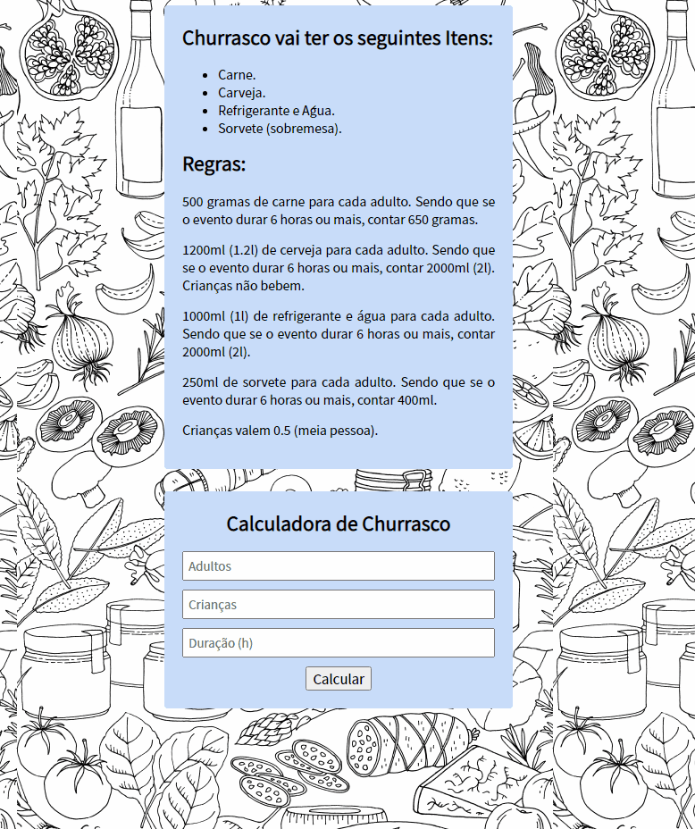

## Churrascômentro

Programa que utilizo HTML, CSS e Javascript e nele calculo a quantidade de carne e bebidas necessária para um churrasco, baseada com quantidade de pessoas e a duração. Desafio proposto no curso do ProgramadorBr.

*Obs:* Crianças valem por 0.5 (meia pessoa)

Carne | Cerveja | Refrigerante/Água | Sorvete
:-------: | :------: | :------: | :------:
500G p/ pessoa |1200Ml p/ pessoa |1000Ml p/ pessoa |250Ml p/ pessoa
Acima de 6H - 650G p/ pessoa | Acima de 6H - 2000Ml p/ pessoa  | Acima de 6H - 2000Ml p/ pessoa  | Acima de 6H - 400Ml p/ pessoa

### 🛠 Tecnologias

As seguintes ferramentas foram usadas na construção do projeto:

- HTML
- CSS
- Javascript

<h4 align="center"> 
	:computer: Projeto concluído :heavy_check_mark:
</h4>

*Link do projeto:* https://jvmsantos13.github.io/churrascometro/

## Autor
João Victor Monteiro  
https://www.linkedin.com/in/jvmsantos/
